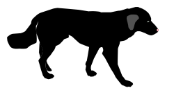

<!-- PROJECT SHIELDS -->
[![gh-pages-shield]][gh-pages-url]
[![website-shield]][website-url]
[![Stargazers][stars-shield]][stars-url]
[![Issues][issues-shield]][issues-url]
[![MIT License][license-shield]][license-url]
[![LinkedIn][linkedin-shield]][linkedin-url]


<!-- PROJECT LOGO -->
<br />
<div align="center">
  <a href="https://github.com/noworneverev/go-germany">
    
  </a>

<h3 align="center">go-germany</h3>

  <p align="center">
    A site that collects all international programs in Germany and all related articles shared by applicants.
    <br />
    <a href="https://noworneverev.github.io/go-germany/"><strong>Explore the site »</strong></a>
    <br />
    <br />
    <a href="https://noworneverev.github.io/go-germany/">View Website</a>
    ·
    <a href="https://github.com/noworneverev/go-germany/issues">Report Bug</a>
    ·
    <a href="https://github.com/noworneverev/go-germany/issues">Request Feature</a>
  </p>
</div>

<!-- TABLE OF CONTENTS -->
<details>
  <summary>Table of Contents</summary>
  <ol>
    <li>
      <a href="#about-the-project">About The Project</a>
      <ul>
        <li><a href="#built-with">Built With</a></li>
      </ul>
    </li>
    <li>
      <a href="#getting-started">Getting Started</a>
      <ul>
        <li><a href="#prerequisites">Prerequisites</a></li>
        <li><a href="#installation">Installation</a></li>
      </ul>
    </li>
    <li><a href="#usage">Usage</a></li>    
    <li><a href="#contributing">Contributing</a></li>
    <li><a href="#license">License</a></li>
    <li><a href="#contact">Contact</a></li>
    <li><a href="#acknowledgments">Acknowledgments</a></li>
  </ol>
</details>

<!-- ABOUT THE PROJECT -->
## About The Project

[![Go Germany Screen Shot][product-screenshot]](https://noworneverev.github.io/go-germany)

As a prospective master student in Germany, I spent a lot of time searching for international programs and their related articles shared by applicants. I know there's a [DAAD site](https://www2.daad.de/deutschland/studienangebote/international-programmes/en/result/?cert=&admReq=&langExamPC=&scholarshipLC=&langExamLC=&scholarshipSC=&langExamSC=&degree%5B%5D=&fos=&langDeAvailable=&langEnAvailable=&lang%5B%5D=&cit%5B%5D=&tyi%5B%5D=&ins%5B%5D=&fee=&bgn%5B%5D=&dat%5B%5D=&prep_subj%5B%5D=&prep_degree%5B%5D=&sort=4&dur=&subjects%5B%5D=&q=&limit=10&offset=&display=list) which is helpful for searching the desired program; however, I don't like the way it displays search results and I think if I can find related articles shared by former applicants at the same time, that would be simply awesome, so I created this site. I want to create a search tool so amazing that it'll be the one you find your desired programs -- I think this it.

Here's why:
* Your time should be focused on your application.
* You shouldn't spend too much effort searching related articles from different sources.

<p align="right">(<a href="#top">back to top</a>)</p>

### Built With
The whole project consists of three repositories, [go-germany](https://github.com/noworneverev/go-germany), [go-germany-api](https://github.com/noworneverev/go-germany-api), and [go-germany-sync](https://github.com/noworneverev/go-germany-sync), which are the frontend, the backend, and the data synchronization tool respectively.

#### go-germany
* [TypeScript](https://github.com/microsoft/TypeScript)
* [React.js](https://reactjs.org/)
* [React Redux](https://github.com/reduxjs/react-redux)
* [Redux Toolkit](https://github.com/reduxjs/redux-toolkit)
* [Material UI](https://github.com/mui/material-ui)

#### go-germany-api
* [Go](https://github.com/golang/go)
* [httprouter](https://github.com/julienschmidt/httprouter)
* [PostgreSQL](https://www.postgresql.org/)
* [pq](https://github.com/lib/pq)

#### go-germany-sync
* [Python](https://www.python.org/)
* [asyncpg](https://github.com/MagicStack/asyncpg)

<p align="right">(<a href="#top">back to top</a>)</p>

<!-- USAGE EXAMPLES -->
## Usage

Use this space to show useful examples of how a project can be used. Additional screenshots, code examples and demos work well in this space. You may also link to more resources.

_For more examples, please refer to the [Documentation](https://example.com)_

<p align="right">(<a href="#top">back to top</a>)</p>

<!-- GETTING STARTED -->
## Getting Started

### Prerequisites

* npm
  ```sh
  npm install npm@latest -g
  ```

### Installation

1. Clone the repo
   ```sh
   git clone https://github.com/noworneverev/go-germany.git
   ```
2. Install NPM packages
   ```sh
   npm install
   ```
3. Enter your local api url in `.env.development`
   ```js
   REACT_APP_API_URL=http://localhost:4000/v1/
   ```
4. Runs the app in the development mode
   ```sh
   npm start
   ```

<p align="right">(<a href="#top">back to top</a>)</p>

<!-- CONTRIBUTING -->
## Contributing

Contributions are what make the open source community such an amazing place to learn, inspire, and create. Any contributions you make are **greatly appreciated**.

If you have a suggestion that would make this better, please fork the repo and create a pull request. You can also simply open an issue with the tag "enhancement".
Don't forget to give the project a star! Thanks again!

1. Fork the Project
2. Create your Feature Branch (`git checkout -b feature/AmazingFeature`)
3. Commit your Changes (`git commit -m 'Add some AmazingFeature'`)
4. Push to the Branch (`git push origin feature/AmazingFeature`)
5. Open a Pull Request

<p align="right">(<a href="#top">back to top</a>)</p>

<!-- LICENSE -->
## License

Distributed under the MIT License. See `LICENSE.md` for more information.

<p align="right">(<a href="#top">back to top</a>)</p>

<!-- CONTACT -->
## Contact

Yan-Ying Liao - [Personal Portfolio](https://noworneverev.github.io/) - n9102125@gmail.com

Project Link: 
- Frontend: [https://noworneverev.github.io/go-germany/](https://noworneverev.github.io/go-germany/)
- Backend: [https://noworneverev.github.io/go-germany-api/](https://noworneverev.github.io/go-germany-api/)
- Data synchronization tool: [https://noworneverev.github.io/go-germany-sync/](https://noworneverev.github.io/go-germany-sync/)

<p align="right">(<a href="#top">back to top</a>)</p>

<!-- ACKNOWLEDGMENTS -->
## Acknowledgments
* The programmes' data is parsed from and daily synchronized with [DAAD Internation Programmes](https://www2.daad.de/deutschland/studienangebote/international-programmes/en/result/?cert=&admReq=&langExamPC=&scholarshipLC=&langExamLC=&scholarshipSC=&langExamSC=&degree%5B%5D=&fos=&langDeAvailable=&langEnAvailable=&lang%5B%5D=&cit%5B%5D=&tyi%5B%5D=&ins%5B%5D=&fee=&bgn%5B%5D=&dat%5B%5D=&prep_subj%5B%5D=&prep_degree%5B%5D=&sort=4&dur=&subjects%5B%5D=&q=&limit=10&offset=&display=list)
* [Img Shields](https://shields.io)
* [GitHub Pages](https://pages.github.com)
* [Heroku](https://www.heroku.com/)
* [React Icons](https://react-icons.github.io/react-icons/search)
* [unDraw](https://undraw.co/)
* Chiao-Yun Chen - Mascot of the site 
* All articles belong to their authors

<p align="right">(<a href="#top">back to top</a>)</p>


<!-- MARKDOWN LINKS & IMAGES -->
<!-- https://www.markdownguide.org/basic-syntax/#reference-style-links -->
[stars-shield]: https://img.shields.io/github/stars/noworneverev/go-germany
[stars-url]: https://github.com/noworneverev/go-germany/stargazers
[issues-shield]: https://img.shields.io/github/issues/noworneverev/go-germany
[issues-url]: https://github.com/noworneverev/go-germany/issues
[license-shield]: https://img.shields.io/github/license/noworneverev/go-germany
[license-url]: https://github.com/noworneverev/go-germany/blob/main/LICENSE.md
[linkedin-shield]: https://img.shields.io/badge/-LinkedIn-black.svg?style=flat&logo=linkedin&colorB=555
[linkedin-url]: https://www.linkedin.com/in/yan-ying-liao/
[product-screenshot]: public/images/screenshot.jpg
[heroku-shield]: https://img.shields.io/badge/%E2%86%91_Deploy_to-Heroku-7056bf.svg?style=flat
[gh-pages-shield]: https://img.shields.io/github/deployments/noworneverev/go-germany/github-pages
[gh-pages-url]: https://github.com/noworneverev/go-germany/deployments/
[website-shield]:https://img.shields.io/website?url=https%3A%2F%2Fnoworneverev.github.io%2Fgo-germany%2F
[website-url]: https://noworneverev.github.io/go-germany/